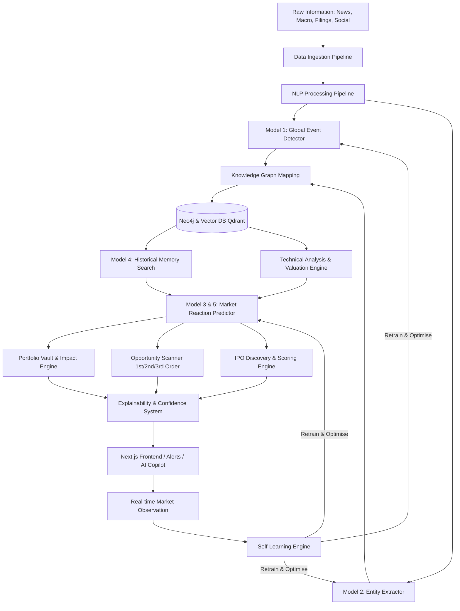
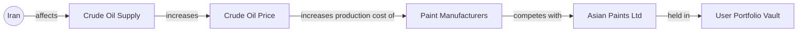
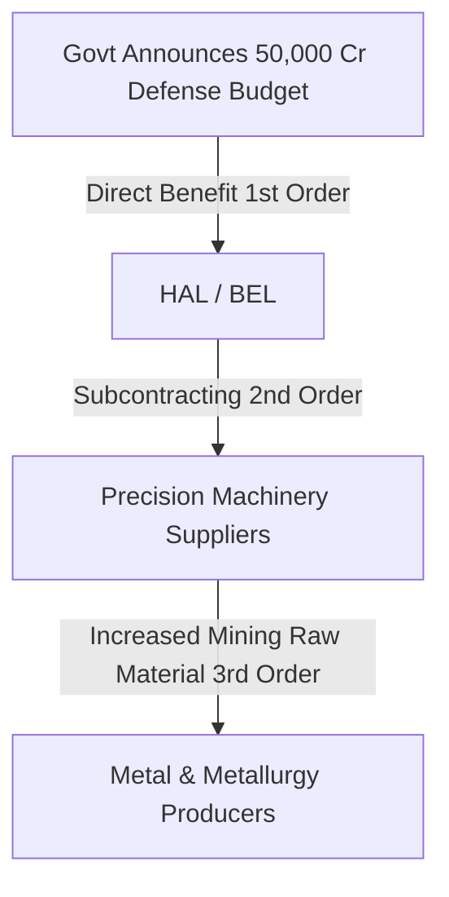
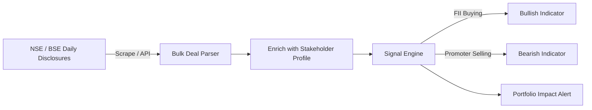
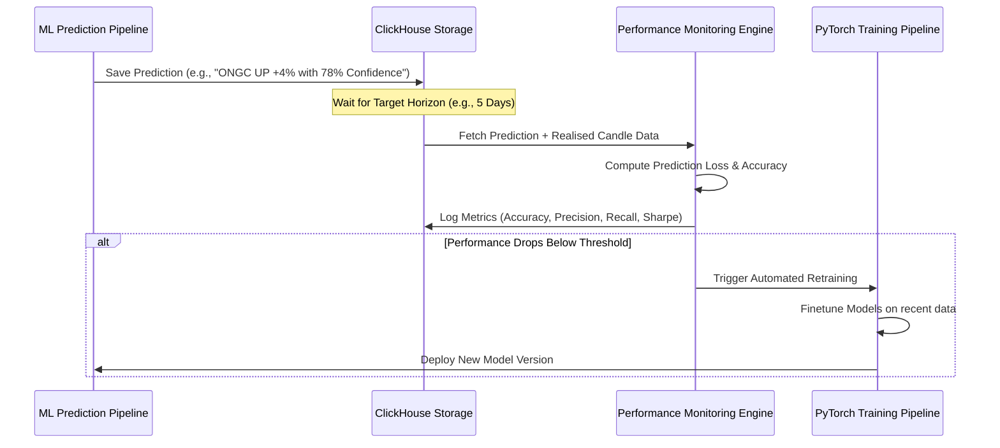

# 🌌 PROJECT TITAN
## Global AI Market Intelligence & Event Impact Platform

> [!IMPORTANT]
> **Project Titan** is a self-learning global market intelligence platform. It continuously ingests, analyzes, and correlates world events to predict economic and stock market impacts. It is designed to act as an institutional-grade, retail-accessible "Bloomberg Terminal" alternative that runs entirely on local, custom-trained ML models, avoiding dependency on proprietary third-party APIs (like OpenAI GPT/Claude) for core intelligence.

---

## 🗺️ Ultimate Flow Architecture

The system operates as a real-time, event-driven pipeline that maps global changes to portfolio risks and trading opportunities.



---

## 🛠️ Python-Oriented Technology Stack

| Component | Technology | Description |
| :--- | :--- | :--- |
| **Frontend** | Next.js, TypeScript, TailwindCSS, Zustand, React Query | Sleek, glassmorphic UI; state management; cached real-time queries. |
| **Charting** | TradingView Lightweight Charts, ECharts | High-performance interactive financial charting. |
| **Backend** | Python, FastAPI, WebSockets | Asynchronous, low-latency API gateway and microservices. |
| **Message Broker** | Apache Kafka | Event streaming for real-time ingestion, predictions, and alerts. |
| **Relational DB** | PostgreSQL | Handles users, portfolios, historical transactions, and configuration. |
| **Timeseries DB** | ClickHouse | Ingests and stores high-frequency market ticks, historical candles, and predictions. |
| **Graph Database** | Neo4j | Maps complex global economic connections and dependency structures. |
| **Vector DB** | Qdrant | Semantic embedding storage for news, earnings filings, and historical similarity search. |
| **Cache & Queues** | Redis, Celery | Task queuing, real-time cache, rate limiting, and session state. |
| **Machine Learning** | PyTorch, Transformers, SentenceTransformers, FinBERT | Local model training, tokenization, embeddings, and mathematical models. |

---

## 📦 Core Architecture & The 16 Layers of Intelligence

### Layer 1: Data Collection Engine
Runs 24/7/365 to ingest unstructured and structured documents. Every incoming item is tagged with a reliability score, country of origin, and language.
*   **Global News:** Reuters, Bloomberg, Financial Times, CNBC, WSJ, Economic Times, Moneycontrol.
*   **Government Sources:** Federal Reserve releases, RBI announcements, White House press briefs, Ministry notifications.
*   **Company Filings:** SEC filings (10-K, 10-Q), NSE/BSE announcements, corporate disclosures, earnings transcripts.
*   **Alternative Data:** Twitter/X, Reddit forums, Google Trends, LinkedIn hiring statistics, patent registrations.
*   **Market Data:** Live feeds for Equities, Indices, Currencies, Commodities, Bonds, and ETFs.

### Layer 2: Event Detection AI (Model 1)
Classifies incoming text into structured, standardized event definitions.
```json
{
  "raw_source": "Reuters",
  "event_type": "Geopolitical Conflict",
  "event_title": "USA attacks Iran nuclear facilities",
  "severity_index": 9.2,
  "confidence_score": 0.94,
  "affected_regions": ["USA", "Iran", "Middle East"],
  "timestamp": "2026-06-15T12:57:35Z"
}
```
**Taxonomy of Events:**
*   *Geopolitical:* War, Sanctions, Trade War, Military Action, Border Disputes.
*   *Economic:* Inflation (CPI/WPI), Deflation, GDP, Interest Rate changes, Unemployment rates.
*   *Company:* Earnings Reports, Mergers & Acquisitions, Layoffs, CEO Changes, Product Recalls.
*   *Regulatory:* Government Bans, FDA Approvals, Anti-trust Investigations, Subsidy Policies.
*   *Market:* Index Crash, Volatility Spikes, Liquidity Squeezes, IPOs/FPOs.

### Layer 3: Market Knowledge Graph
Constructs semantic connections in **Neo4j** linking macro indicators to individual stocks.



*   **Nodes:** `Country`, `Sector`, `Industry`, `Company`, `Commodity`, `ETF`, `Currency`, `Index`, `Stock`, `IPO`, `Event`.
*   **Edges:** `affects`, `owns`, `imports`, `exports`, `supplies`, `depends_on`, `competes_with`, `benefits_from`, `harmed_by`, `invests_in`.

### Layer 4: Impact Engine
Calculates directional and magnitude vectors for companies based on knowledge graph paths.
*   *Example Event:* Iran closes the Strait of Hormuz.
*   *Calculated Sentiment Vectors:*

| Company | Sector / Industry | Predicted Impact (-10 to +10) | Primary Driver |
| :--- | :--- | :---: | :--- |
| **ONGC** | Oil Production | **+8.5** | Surging crude prices boost exploration margins. |
| **Oil India** | Oil Exploration | **+7.8** | domestic production pricing linked to global benchmarks. |
| **InterGlobe Aviation (IndiGo)** | Airlines | **-9.1** | Aviation Turbine Fuel (ATF) costs spike immediately. |
| **Asian Paints** | Paints & Chemicals | **-5.4** | Crude derivative monomers constitute 50% of raw materials. |

### Layer 5: Historical Pattern Matching (Model 4)
Uses vector similarity searches (via **Qdrant**) across 30+ years of geopolitical and macroeconomic history to discover past market outcomes.
*   *Workflow:* Extract the embeddings of the current event vector -> Query Qdrant for events with similarity score > 80% -> Aggregate the market response charts of matching dates.
*   *Example Match:* Current Iran escalations query matches the **2003 Iraq Invasion** (84% similarity) and the **2022 Russia-Ukraine War** (79% similarity).

### Layer 6: Market Reaction Predictor (Model 5)
Outputs a probability distribution rather than deterministic price targets.
```json
{
  "ticker": "ONGC",
  "prediction_horizon": "5_business_days",
  "probability_distribution": {
    "bullish_move_greater_than_5pct": 0.74,
    "sideways_move_within_2pct": 0.18,
    "bearish_move_greater_than_5pct": 0.08
  },
  "estimated_volatility_regime": "High"
}
```

### Layer 7: Portfolio Vault
Securely monitors users' real-time stock holdings and quantifies multi-asset exposure.
*   Aggregates exposure to sectors (e.g., Banking, Tech), geographic markets, raw commodities (e.g., Oil, Copper), and currency fluctuations.

### Layer 8: Buy/Hold/Sell Probabilistic Assistant
Assists decision-making without giving generic financial advice.
*   Outputs dynamic confidence metrics. Example: *"Based on 82 occurrences of oil supply shocks, ONGC has historical upward momentum in 74% of cases. Recommendation: Hold/Accumulate. Confidence: 74%."*

### Layer 9: Opportunity Scanner
Traces second-order and third-order effects to uncover hidden alpha.


### Layer 10: IPO Intelligence
Tracks upcoming, active, and past IPOs. Evaluates structural fundamentals (e.g., revenue CAGR, debt-to-equity, sector growth trends) and maps grey market premium (GMP) trends to compute an **IPO Strength Score** (out of 10).

### Layer 11: Lead Generation Engine
Generates personalized, event-triggered opportunities matched to the user's risk preferences and existing portfolio layout.

### Layer 12: Personalized AI Feed
Filters noise and delivers highly context-aware news. Instead of showing general geopolitical headlines, the platform explains *why* the headline directly impacts your specific portfolio holdings.

### Layer 13: Risk Radar
Monitors systemic and company-specific red flags:
*   Promoter selling/pledging spikes.
*   Debt servicing coverage ratio drop.
*   Corporate governance deviations (auditor resignations, legal disputes).
*   Macro risks (rate hikes, regulatory clampdowns).

### Layer 14: AI Explanation Layer
Outputs readable step-by-step reasoning chains explaining the platform's outputs.
*   *Query:* "Why is Asian Paints crashing?"
*   *Output:*
    1. Geopolitical conflict in Middle East -> Oil supply risk escalated.
    2. Crude Oil prices surged 6% in 24 hours.
    3. Paint companies depend on oil derivatives for 50% of raw materials.
    4. Model predicts margin contraction of ~150bps next quarter.
    5. Similar contraction pattern verified in 2022 Russia-Ukraine shock.

### Layer 15: Confidence System
Every prediction and sentiment output is scored with a confidence interval computed using evidence count, reliability score of source data, and model variance.

### Layer 16: Stakeholder Intelligence Engine
Provides deep, real-time visibility into **who owns** a company, **how ownership changes over time**, and **who is actively trading** — critical signals that retail investors usually miss.

#### 16.1 — Shareholding Pattern Tracker
Fetches and normalises quarterly shareholding data from NSE/BSE filings for every tracked company.

| Stakeholder Category | What We Track | Signal Value |
| :--- | :--- | :--- |
| **Promoters & Promoter Group** | Holding %, pledge %, quarter-over-quarter change | Promoter selling or pledging is the strongest negative signal. |
| **Foreign Institutional Investors (FII/FPI)** | Aggregate holding %, individual top FII names, QoQ delta | Institutional confidence barometer — FII accumulation signals global smart-money conviction. |
| **Domestic Institutional Investors (DII)** | Mutual Funds, Insurance, Banks — holding % and change | DII buying during FII selling indicates domestic floor support. |
| **Mutual Funds** | Individual scheme-level holdings (e.g., HDFC Flexi Cap holds 2.1% of Reliance) | Reveals which fund managers have high conviction. |
| **Retail / Public** | Individual investor aggregate % | High retail % with declining institutions = potential risk. |

Output example per company:
```json
{
  "ticker": "RELIANCE.NS",
  "quarter": "Q1-2026",
  "shareholding": {
    "promoter_pct": 50.29,
    "promoter_pledge_pct": 0.00,
    "fii_pct": 23.41,
    "dii_pct": 14.87,
    "mutual_fund_pct": 7.12,
    "retail_pct": 11.43
  },
  "changes_vs_prev_quarter": {
    "promoter_delta": -0.03,
    "fii_delta": +1.24,
    "dii_delta": -0.58,
    "mutual_fund_delta": +0.33
  },
  "top_institutional_holders": [
    {"name": "Vanguard Group", "type": "FII", "pct": 1.82},
    {"name": "SBI Mutual Fund", "type": "MF", "pct": 1.47},
    {"name": "LIC of India", "type": "DII", "pct": 3.91}
  ]
}
```

#### 16.2 — Bulk & Block Deal Tracker
Monitors NSE/BSE daily bulk deal and block deal disclosures in real time. These reveal large institutional trades that the exchange mandates must be disclosed.

*   **Bulk Deals:** Trades exceeding 0.5% of total shares — publicly disclosed with buyer/seller name, quantity, and price.
*   **Block Deals:** Large negotiated trades (minimum ₹10 crore) executed in a special trading window.



#### 16.3 — Insider Trade Monitor
Tracks SEBI-mandated insider trading disclosures (SAST regulations). Every director, KMP (Key Managerial Personnel), and connected person must disclose trades above a threshold.

*   Detects patterns: *Director bought ₹5 Cr worth of shares 2 weeks before earnings → historically bullish signal.*
*   Correlates with upcoming corporate events (earnings, board meetings, M&A).
*   Generates alerts: **"CFO of TCS purchased 50,000 shares at ₹3,450 — highest insider buy in 18 months."**

#### 16.4 — Institutional Flow Heatmap
Aggregates FII/DII daily buy/sell data across the entire market to identify sector-level money flows.

| Date | FII Net (₹ Cr) | DII Net (₹ Cr) | Market Signal |
| :--- | ---: | ---: | :--- |
| 2026-06-14 | -2,340 | +1,890 | FII selling, DII absorbing — cautious. |
| 2026-06-13 | +3,100 | +450 | Both buying — strongly bullish. |
| 2026-06-12 | -5,200 | +4,800 | Heavy FII exit, DII defending — volatile. |

#### 16.5 — Smart Money Signals
Combines all stakeholder data into composite conviction scores:
*   **Accumulation Score:** Promoter buying + FII accumulation + insider purchases → strong conviction.
*   **Distribution Score:** Promoter selling + FII exit + insider selling → red flag.
*   **Divergence Alert:** FII buying while promoter sells → investigate deeper (potential governance issue or FII sees value promoter doesn't).

### Layer 17: Future Advanced Capabilities
*   **AI Earnings PDF Analyzer:** Instantly reads uploaded earnings transcript PDFs, extracting forward guidance and key financial targets.
*   **Event Simulator:** Allows users to run scenarios (e.g., *"What if Brent crude reaches $120/barrel?"*) and maps the simulated impact across the entire portfolio.
*   **Prediction Marketplace:** Compare the platform's prediction accuracy against analysts, funds, and public benchmarks.
*   **Market Replay Engine:** Replay any historical market day and observe how the AI pipeline would have responded.

---

## 🧠 Custom ML Models & In-House NLP

We do not depend on external APIs. The intelligence models are built using **PyTorch** and **HuggingFace Transformers**:

```
                              [Incoming Text Doc]
                                       │
                ┌──────────────────────┴──────────────────────┐
                ▼                                             ▼
     [Model 1: Event Detector]                     [Model 2: Entity Extractor]
  (Fine-tuned FinBERT Classifier)               (Custom Token Classification / NER)
  - Identifies Event Type                       - Extracts: Stocks, Countries,
  - Computes Severity (0.0 to 1.0)                Commodities, Sectors
                │                                             │
                └──────────────────────┬──────────────────────┘
                                       ▼
                         [Knowledge Graph Relation]
                                       │
                                       ▼
                       [Model 3: Impact Prediction Network]
                         (GNN / Graph Neural Network)
                       - Evaluates propagation of shock
                       - Output: Vector of impact weights
```

### Model Specifications

1.  **Model 1: Global Event Detector**
    *   **Architecture:** Fine-tuned `FinBERT` sequence classification model.
    *   **Classes:** 32 primary financial/geopolitical event types.
    *   **Output:** `[Event_Class, Severity_Index (0.0 - 1.0)]`.
2.  **Model 2: Entity Extractor**
    *   **Architecture:** Named Entity Recognition (NER) utilizing custom token-level classification.
    *   **Entities:** `ORG` (Companies), `GPE` (Countries), `CMD` (Commodities), `SEC` (Sectors).
3.  **Model 3: Impact Prediction Network**
    *   **Architecture:** Graph Convolutional Network (GCN) built over the Neo4j knowledge graph structure.
    *   **Task:** Node regression forecasting the expected directional move (-1.0 to +1.0) for every company node.
4.  **Model 4: Historical Pattern Engine**
    *   **Architecture:** `SentenceTransformers` (e.g., `all-mpnet-base-v2`) generating event embeddings.
    *   **Storage:** Cosine-similarity searches indexable via Qdrant.
5.  **Model 5: Market Reaction Predictor**
    *   **Architecture:** Temporal Fusion Transformer (TFT) or XGBoost.
    *   **Inputs:** Graph impact embeddings, macro indicators, and technical market indicators.

---

## 📈 Dynamic Trading & Valuation Engines

All technical indicators and value zones are computed mathematically on live market feeds. There are **zero static thresholds** or hardcoded boundaries.

### Dynamic Buy & Sell Zones
Calculated dynamically based on institutional order flow and market microstructure:
*   **Liquidity & Order Blocks:** Identifies price zones with elevated limit order concentrations using ClickHouse order book depth.
*   **Dynamic Support & Resistance:** Calculated using volume-weighted average price (VWAP) deviations and historical high-volume nodes (Volume Profile) rather than simple pivots.
*   **Volatility Regimes:** Utilizes Average True Range (ATR) and Bollinger Band width expansions to adapt margins according to current market speed.

### Dynamic Valuation Engine
Evaluates asset health in real time:
*   **Continuous Discounted Cash Flow (DCF):** Recalculates intrinsic value ranges dynamically as the risk-free rate (10Y Bond Yield) fluctuates.
*   **Relative Valuation Engine:** Computes peer-relative metrics (P/E, EV/EBITDA, P/B) against weighted industry averages.
*   **Margin of Safety:** Calculates the probability distribution that the current price is below the intrinsic value range.

---

## 🔄 The Self-Learning Feedback Loop

Project Titan grows smarter over time using an automated evaluation cycle:



---

## 🌟 Elite Features & moats

> [!TIP]
> **Market Replay Engine**
> Replay historical market days (e.g., the 2008 Lehman crisis, 2020 COVID crash) in real time. Validate how the ingestion, Graph mappings, and predictions would have responded step-by-step.

> [!NOTE]
> **Causal Graph Engine**
> Distinguishes between correlation and likely causation using structural structural causal models (SCM) to avoid false-positive associations.

> [!WARNING]
> **Data Quality Scoring**
> Data is evaluated before feeding models. Any source displaying repeated statistical anomalies or reporting delays is assigned a lower reliability weight in Layer 15.

*   **Agent Framework:** Dedicated micro-agents coordinate specific tasks: Geopolitics Agent, Commodities Agent, Earnings Agent, IPO Agent, Macro Agent, and Risk Agent.
*   **Paper Trading Environment:** Users can execute simulated positions based on AI event alerts to benchmark portfolio alpha.
*   **Scenario Simulator:** Run stress tests: *"What if the Federal Reserve cuts rates by 50bps AND Brent crude rises by 15%?"* Instantly maps the resulting stress vector across user portfolios.

---

## 🔒 Security & Observability

*   **Security:** Multi-tenant access controls, JWT tokens, isolated API routing via Nginx, and encrypted secrets storage.
*   **Observability:** Prometheus metrics collection, Grafana dashboards tracking prediction latency and database performance, and OpenTelemetry distributed tracing across microservices.
*   **Model Governance:** Every model checkpoint, dataset split, and prediction run is versioned and trackable.
*   **Data Backups:** Automatic daily database replication for PGSQL and historical ClickHouse data.
